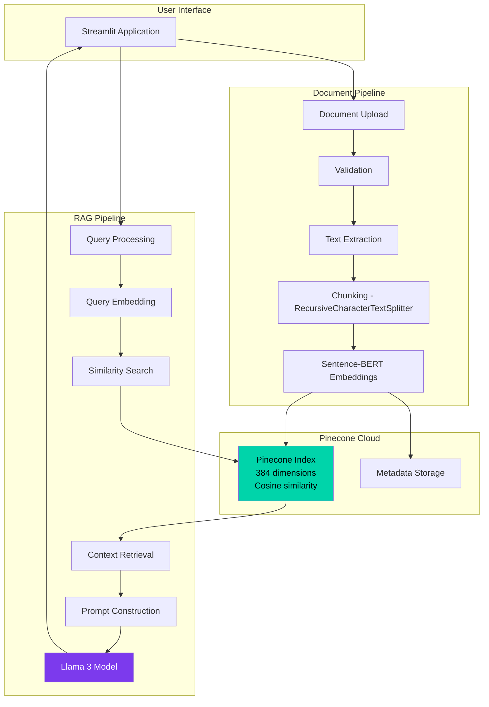

# Woolworths RAG System: Pinecone + Sentence Transformers + Llama 3

A Retrieval-Augmented Generation (RAG) system designed for Woolworths South Africa, leveraging Pinecone for vector storage, Sentence-BERT for embeddings, and Llama 3 as the open-source LLM. Built with Streamlit and LangChain.

---

## Table of Contents
- Overview
- Business Context
- Technology Stack
- System Architecture
- Installation
- Configuration
- Knowledge Base
- Usage
- Testing
- Deployment
- Project Structure
- Technical Documentation
- Troubleshooting
- Contributing
- License

---

## Overview

This project demonstrates a modern RAG pipeline for Woolworths South Africa, a premium retailer focused on sustainability and customer service. The system enables rapid, conversational access to business documentation (policies, compliance, supplier standards, ESG reports) using open-source and cloud-native technologies.

---

## Business Context

Woolworths South Africa is known for its premium positioning, sustainability initiatives, and high standards in food, clothing, and homeware. The documentation structure emphasizes compliance, supplier relationships, and ESG reporting.

---

## Technology Stack

| Component   | Technology                        | Reasoning                                                      |
|------------|-----------------------------------|----------------------------------------------------------------|
| Retailer    | Woolworths SA                    | Premium, sustainability focus, unique documentation            |
| Vector DB   | Pinecone                         | Managed cloud, serverless, scalable, production-ready          |
| Embeddings  | Sentence-BERT (all-MiniLM-L6-v2) | Fast, efficient, strong semantic understanding                 |
| LLM         | Llama 3 (8B/70B)                 | Open-source, strong performance, free to use                   |
| Framework   | LangChain                        | Consistency, modular RAG orchestration                        |
| Frontend    | Streamlit                        | Consistency, rapid prototyping, interactive UI                 |

---

## System Architecture



---

## Installation

### Prerequisites
- Python 3.11+
- Pinecone account & API key
- Streamlit
- LangChain
- Sentence Transformers
- Llama 3 model (local or via API)

### Steps
1. Clone the repository
2. Create and activate a virtual environment
3. Install dependencies (`pip install -r requirements.txt`)
4. Configure Pinecone API key and Llama 3 model path in `.env`
5. Run `streamlit run app.py`

---

## Configuration

Edit `config.py` for:
- Pinecone index name, API key
- Embedding model: `all-MiniLM-L6-v2`
- LLM: Llama 3 (local path or API endpoint)
- Chunk size, overlap, allowed file types

---

## Knowledge Base

| Document                                 | Content                                      | Purpose                       |
|------------------------------------------|----------------------------------------------|-------------------------------|
| woolworths-sustainability-policy.md      | Sustainability goals, carbon targets         | Strategic direction           |
| woolworths-ethical-sourcing-standards.md | Supplier code of conduct, audits             | Supplier compliance           |
| woolworths-waste-management-guidelines.md| Waste reduction, recycling protocols         | Operational compliance        |
| woolworths-esg-reporting-requirements.md | ESG metrics, templates, regulatory needs     | Corporate reporting           |
| woolworths-environmental-compliance.md   | Legal obligations, permits, audit checklists | Legal compliance              |

---

## Usage

- Upload documents via UI or place in `data/documents/`
- Query sustainability, compliance, or supplier topics in chat
- Example queries:
    - "What are Woolworths’ 2025 carbon reduction targets?"
    - "Show me the supplier audit checklist for ethical sourcing."
    - "How do we report on plastic waste reduction for ESG?"
    - "Summarize the renewable energy commitments for our stores."

---

## Testing

- Unit tests for config, utils, RAG pipeline, and UI logic
- Run: `python -m unittest discover -s tests -p "test_*.py" -v`
- Coverage: `python -m coverage run --source=. -m unittest discover -s tests`

---

## Deployment

- Deploy on Streamlit Community Cloud or internal server
- Configure Pinecone and Llama 3 endpoints for production
- Secure API keys and sensitive data

---

## Project Structure

```
RAG-WOOLWORTHS-AI-COMPLIANCE-SUSTAINABILITY/
│
├── src/                          # Source code
│   ├── modules/                  # Core business logic
│   │   ├── __init__.py
│   │   ├── rag_engine.py        # RAG engine with Pinecone
│   │   ├── config.py            # Configuration management
│   │   └── utils.py             # File processing utilities
│   │
│   ├── ui/                       # User interface components
│   │   ├── __init__.py
│   │   ├── session_manager.py   # Session state management
│   │   ├── ui_components.py     # Reusable UI elements
│   │   ├── chat_manager.py      # Chat interface
│   │   ├── document_manager.py  # Document processing
│   │   └── sidebar_manager.py   # Sidebar orchestration
│   │
│   └── __init__.py
│
├── tests/                        # Test suite
│   ├── __init__.py
│   ├── test_config.py
│   ├── test_utils.py
│   ├── test_rag_engine.py
│   └── test_app_functions.py
│
├── data/                         # Data storage
│   ├── documents/               # Knowledge base documents
│   └── pinecone_index/          # Pinecone configurations
│
├── docs/                         # Documentation
│   ├── README.md               # Documentation index
│   └── DOCUMENTATION.md        # Full technical docs
│
├── assets/                       # Static assets
│
├── app.py                        # Main application entry point
├── requirements.txt              # Python dependencies
├── .env.example                  # Environment variables template
├── .gitignore                    # Git ignore rules
└── README.md                     # This file
```

---

## Technical Documentation

| Component   | Technology                        | Details                                    |
|------------|-----------------------------------|--------------------------------------------|
| Frontend    | Streamlit                        | Interactive web UI                         |
| Framework   | LangChain                        | RAG orchestration                          |
| Vector DB   | Pinecone                         | Cloud, cosine similarity, 384 dimensions   |
| Embeddings  | Sentence-BERT (all-MiniLM-L6-v2) | HuggingFace, fast, semantic                |
| LLM         | Llama 3 (8B/70B)                 | Meta, open-source, local or API            |
| Language    | Python 3.11+                     | Core programming language                  |

---

## Troubleshooting

- Pinecone connection errors: check API key and index name
- Llama 3 model errors: verify model path or API endpoint
- Document not loading: check file format and size
- Slow queries: optimize chunk size, check Pinecone status

---

## Contributing

- Fork and create feature branches
- Follow PEP 8 and add docstrings
- Write unit tests for new features
- Submit pull requests with clear descriptions

---

## License

Proprietary software for Woolworths South Africa. Internal use only. Third-party components subject to their respective licenses.

---

## Support and Contact

- IT Support: it-support@woolworths.co.za
- Sustainability: sustainability@woolworths.co.za

---

## Acknowledgments

- Meta for Llama 3
- Pinecone for vector search
- HuggingFace for Sentence Transformers
- LangChain for RAG framework
- Streamlit for UI

---

**Version**: 1.0.0  
**Last Updated**: December 2025  
**Maintained By**: Woolworths IT Development Team
